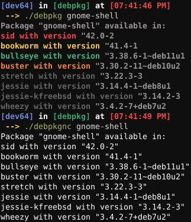

# debpkg, a python script to retrieve information for a package from debian repos

using [sources.debian.org](https://sources.debian.org/api)

# why 2 files?

one file (debpkg) has color support, and the other (debpkgnc) doesnt have colors. the colors dont show anything about the package by the way, its based on the distro/repo type (red for experimental, yellow for testing and so on). by the way, if on linux, you can just do `./debpkg` instead of `python3 debpkg`

# requirements
+ python 3.6 or 7 and higher
+ requests, pip3 install requests
+ colorhex (**IF** using debpkg), pip3 install colorhex

# how to use
run the script with the packages name, like: `./debpkg NAME` (`./debpkg gnome-shell` for example). if on windows, use `python3 debpkg`